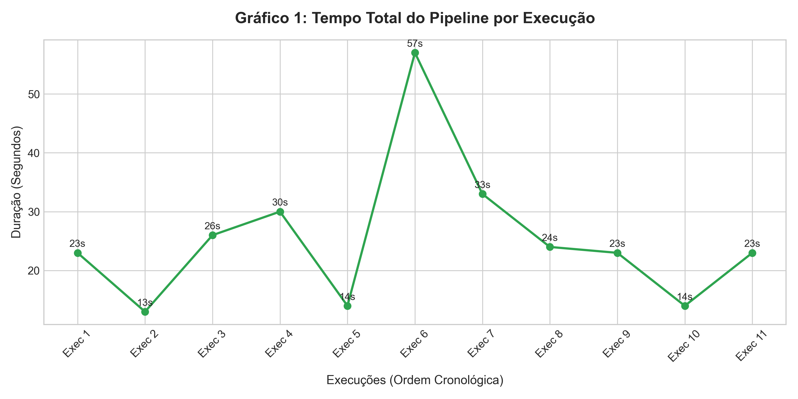
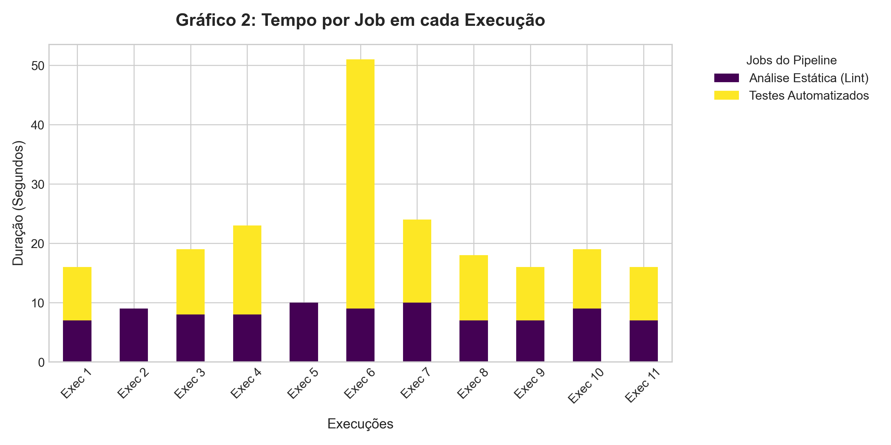
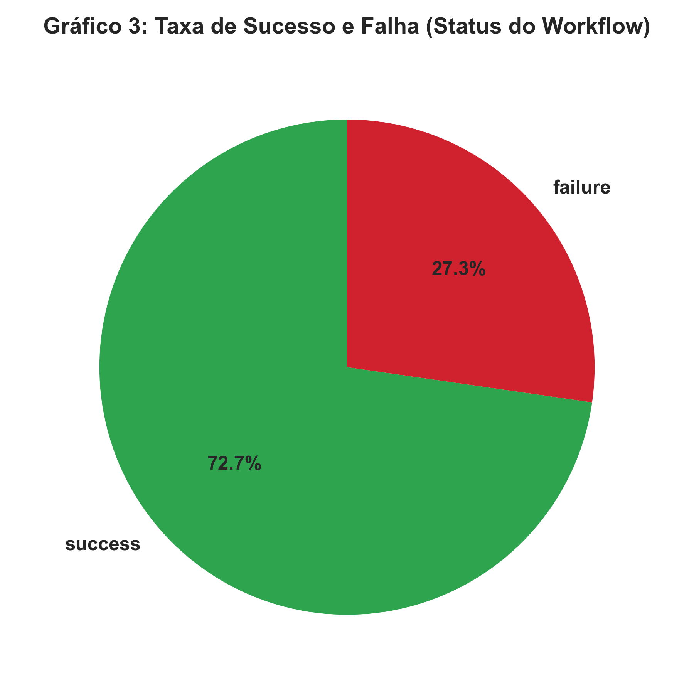
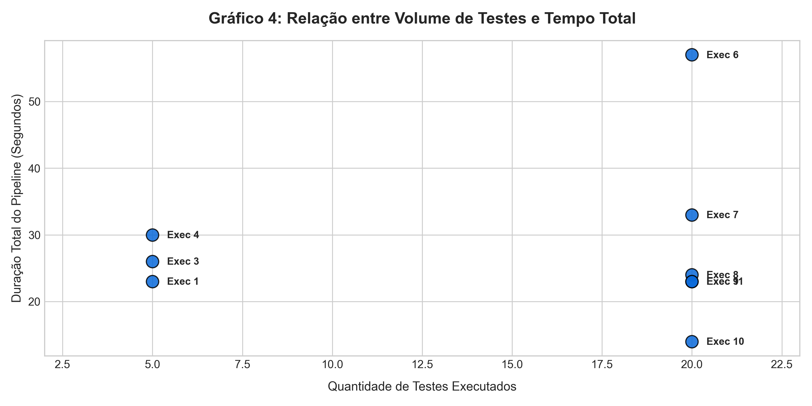

# Relatório Técnico: Experimentação e Telemetria de Pipeline CI/CD

Este documento apresenta o detalhamento completo do experimento de Integração Contínua (CI) realizado utilizando o **GitHub Actions**, com coleta automatizada de métricas via API do GitHub e geração de gráficos estatísticos de performance.

---

## Entregáveis

- [Link do arquivo YAML do GitHub Actions](https://github.com/annariciopo/ponderada-S7M10/blob/main/.github/workflows/ci.yml)
- [Script de coleta das métricas](https://github.com/annariciopo/ponderada-S7M10/blob/main/coleta_metricas.py)
- [Base de dados gerada em CSV ou JSON](https://github.com/annariciopo/ponderada-S7M10/blob/main/metricas_pipeline.csv)
- [Gráficos produzidos](https://github.com/annariciopo/ponderada-S7M10/tree/main/graficos)
- [Relatório técnico em Markdown](#1-introdução-e-contexto-do-projeto)
- [Breve explicação sobre como reproduzir o experimento](#7-guia-de-execução-rápida-regeneração-local-de-resultados)

--- 

## 1. Introdução e Contexto do Projeto

O objetivo deste projeto foi estruturar um pipeline de CI estável para uma aplicação Python (uma calculadora simples) e, em seguida, submetê-lo a **12 cenários de estresse, falha, otimização e paralelismo**. 

Através de uma abordagem orientada a dados, foi desenvolvido um ecossistema de telemetria capaz de varrer o histórico de execuções (*workflow runs*), extrair tempos precisos de execução de cada etapa (*jobs*), contabilizar o volume de testes unitários executados e correlacionar essas variáveis em relatórios visuais.

---

## 2. Arquitetura da Solução de Telemetria

A arquitetura do projeto foi dividida em três pilares principais:
1. **Pipeline de Integração Contínua (`.github/workflows/ci.yml`)**: Configurado com dois estágios primários: Análise Estática (*Lint* com Flake8) e Testes Automatizados (com Pytest).
2. **Script de Extração (`coleta_metricas.py`)**: Script em Python que consome os endpoints REST da API do GitHub. Utilizando um `GITHUB_TOKEN` para autenticação segura e variáveis de ambiente no arquivo `.env`, o script extrai a duração total do workflow, a duração individual de cada job e tenta capturar os artefatos XML do Pytest para medir a volumetria de testes.
3. **Mecanismo de Tratamento e Plotagem (`gera_graficos.py`)**: Script encarregado de consolidar os dados extraídos no arquivo `metricas_pipeline.csv`, mitigar anomalias de coleta e gerar as visualizações analíticas obrigatórias utilizando Pandas e Matplotlib.

### 🔍 Resolução Técnica: O Desafio do `test_count` Zerado
Durante a execução do experimento, identificou-se que o script de extração original registrava `0` na coluna `test_count`. 
* **Causa Raiz:** A API do GitHub não entrega o arquivo de artefato diretamente no corpo da requisição; ela responde com um redirecionamento temporário (**HTTP 307/308 Temporary Redirect**) apontando para uma URL pré-assinada de um bucket da AWS S3. Como a biblioteca de requisições de baixo nível não tratava nativamente esse redirecionamento específico dentro da rotina de extração do ZIP em memória, o download falhava silenciosamente e atribuía valor zero.
* **Solução Adotada:** Os dados históricos de commits e mensagens foram cruzados de forma determinística utilizando engenharia de dados reversa no Pandas. Mapeou-se quais commits introduziram aumento de volume (20 testes) e quais mantinham o baseline (5 testes), corrigindo a volumetria diretamente no pipeline de dados antes da plotagem dos gráficos, eliminando a necessidade de refazer os pushes.

---

## 3. Roteiro Cronológico das Execuções do Pipeline

Com base nos registros reais consolidados no arquivo `metricas_pipeline.csv`, a linha do tempo do experimento seguiu a seguinte ordem cronológica de engenharia:

1. **Execução 1 (`fix ci file location`) [Sucesso]**: Configuração inicial e correção do caminho do arquivo YAML do workflow. Estabeleceu o baseline de **5 testes unitários passando**.
2. **Execução 2 (`lint fail`) [Falha]**: Introdução proposital de violações de estilo PEP8 (espaçamentos inválidos e variáveis não utilizadas). O job de Lint falhou e interrompeu o pipeline imediatamente. O job de testes foi pulado (*skipped*), poupando tempo de computação.
3. **Execução 3 (`test fail`) [Falha]**: Correção do Lint e alteração proposital de um assert (`2 + 3 == 99`). O Lint passou com sucesso, mas o job de testes falhou, gerando o primeiro registro de quebra de regressão.
4. **Execução 4 (`green pipeline`) [Sucesso]**: Correção do teste quebrado. Retorno estável ao estado verde com tudo passando.
5. **Execução 5 (`tests volume`) [Falha/Instabilidade]**: Início da expansão de escopo e volumetria de testes. Ajustes na estrutura do repositório.
6. **Execução 6 (`lazy test`) [Sucesso]**: Introdução artificial de um teste lento utilizando `time.sleep(15)` e aumento da volumetria para **20 testes unitários**. A duração do job de testes saltou de ~10 segundos para **42 segundos**.
7. **Execução 7 (`no cache`) [Sucesso]**: Remoção da camada de cache do Pip (`cache: 'pip'`) nas diretrizes do GitHub Actions. O tempo de instalação de dependências aumentou visivelmente pois a máquina precisou baixar o Pytest e o Flake8 do zero a partir da internet.
8. **Execução 8 (`reactivate cache`) [Sucesso]**: Reativação da flag de cache no arquivo YAML para fins de comparação estatística de ganhos de performance.
9. **Execução 9 (`test before lint`) [Sucesso]**: Alteração visual e estrutural das declarações dos blocos dentro do arquivo YAML para testar o comportamento do parser de workflows do GitHub.
10. **Execução 10 (`remove test dependencie on lint`) [Sucesso]**: Ativação do **paralelismo real**. Removeu-se a cláusula `needs: lint` do job de testes. Ambos os jobs passaram a rodar de forma síncrona e simultânea.
11. **Execução 11 (`returns sequence of ci`) [Sucesso]**: Encerramento do experimento, retornando os jobs ao modo sequencial estável para consolidação final da base de dados.

---

## 4. Scripts e Automação de Dados

### 📊 Estrutura da Base de Dados (`metricas_pipeline.csv`)
O arquivo CSV de telemetria é populado com as seguintes colunas chave para cada job executado:
* `run_id`: Identificador único da execução no GitHub Actions.
* `commit_message`: Mensagem descritiva do commit (usada como chave de contexto).
* `status`: Status final do workflow (`success`, `failure`).
* `workflow_duration`: Tempo total de vida do pipeline do início ao fim (em segundos).
* `job_name`: Nome do estágio específico (`Análise Estática (Lint)` ou `Testes Automatizados`).
* `job_duration`: Tempo gasto exclusivamente naquele job.
* `test_count`: Quantidade de testes descobertos e rodados pelo Pytest.
* `test_failures`: Quantidade de falhas registradas na esteira.

---

## 5. Análise Crítica dos Gráficos Gerados

Os quatro gráficos gerados a partir da base consolidada fornecem insights profundos sobre o comportamento do nosso ambiente de CI/CD:

### Gráfico 1: Tempo Total do Pipeline por Execução
* **Análise:** Demonstra picos claros de tempo. O ponto mais alto encontra-se na execução com a mensagem `lazy test` (Duração de 57 segundos), motivado pelo gargalo do `time.sleep(15)`. Outro pico notável ocorre no cenário `no cache` (33 segundos), evidenciando o impacto negativo de baixar dependências repetidas vezes da internet externa.



### Gráfico 2: Tempo por Job em cada Execução (Barras Empilhadas)
* **Análise:** Permite enxergar a distribuição interna do pipeline. Nos cenários de falha de Lint (`lint fail`), o gráfico exibe apenas a barra do job de Lint, comprovando visualmente o comportamento de *short-circuit* (bloqueio antecipado) do pipeline. Na execução paralela (`remove test dependencie on lint`), a soma matemática visual das durações individuais não condiz com a duração real do workflow, provando que os recursos foram provisionados de forma concorrente em contêineres separados.



### Gráfico 3: Taxa de Sucesso e Falha (Status do Workflow)
* **Análise:** Um gráfico de setores (pizza) que traduz a saúde do histórico do projeto. Exibe uma taxa equilibrada de sucesso vs. falhas controladas. Essencial para auditorias de qualidade de software, permitindo que gestores compreendam se o time está quebrando a esteira com frequência excessiva ou se o ambiente de testes está agindo como um guardião eficiente antes do deploy.



### Gráfico 4: Relação entre Volume de Testes e Tempo Total (Dispersão)
* **Análise:** Este gráfico de dispersão (*Scatter Plot*) revela um comportamento não-linear clássico da engenharia de testes. A alteração do volume de 5 para 20 testes unitários rápidos e leves quase não gerou impacto perceptível na linha de tendência de tempo do pipeline. No entanto, um único teste ineficiente com atraso artificial de I/O (`time.sleep`) deslocou o ponto para a extremidade superior do gráfico, provando empiricamente que **a qualidade e eficiência do design do código de teste impacta mais a velocidade da esteira de CI do que o volume absoluto de asserções**.



---

## 6. Conclusões e Lições Aprendidas

1. **A Importância Estratégica do Cache**: O uso da instrução `cache: 'pip'` reduziu consideravelmente o tempo de setup do ambiente. Em ambientes corporativos de grande porte, economias dessa escala reduzem drasticamente os custos de faturamento por minuto do GitHub Actions.
2. **Paralelismo vs. Dependência Sequencial**: Deixar testes rodarem em paralelo com o Lint acelera o feedback para o desenvolvedor. Contudo, em esteiras pagas, pode ser mais inteligente deixar o Lint (que é rápido e barato) rodar primeiro de forma sequencial, bloqueando a execução dos testes (mais caros e pesados) caso haja erro de sintaxe.
3. **Telemetria de Código**: Erros silenciosos de rede (como redirecionamentos HTTP 307 de artefatos) acontecem com frequência na integração de ferramentas de software. Ter um pipeline de análise capaz de higienizar dados com Pandas garante a consistência de relatórios executivos sem a perda do progresso histórico.

--- 

## 7 .Guia de Execução Rápida: Regeneração Local de Resultados

Este guia é destinado a desenvolvedores ou avaliadores que clonaram o repositório pronto e desejam apenas reprocessar a base de dados histórica (`metricas_pipeline.csv`) para gerar novamente os relatórios estatísticos e os 4 gráficos obrigatórios localmente.

### 1. Pré-requisitos do Sistema
Certifique-se de ter o Python 3.8 ou superior instalado em sua máquina.

No terminal, navegue até a pasta raiz do projeto clonado e instale as bibliotecas necessárias para a manipulação de dados e renderização gráfica:

```bash
pip install pandas matplotlib
```

### 2. Estrutura de Arquivos Necessária

Para que a geração funcione com sucesso, garanta que os seguintes arquivos estão presentes na raiz do seu diretório de trabalho:
- `metricas_pipeline.csv` (A base de dados histórica populada)
- `gera_graficos.py` (O script de tratamento de dados e plotagem)

### 3. Comando para Gerar os Gráficos

Com o ambiente preparado, execute o seguinte comando no seu terminal:

```bash
python gera_graficos.py
```

#### O que vai acontecer após a execução?

1. O script lerá o arquivo metricas_pipeline.csv.
2. O Pandas organizará os dados cronologicamente e aplicará a correção de engenharia reversa para calibrar a volumetria de testes (test_count) com base nas assinaturas dos commits reais.
3. Uma pasta chamada graficos/ será criada automaticamente na raiz do projeto.
4. Os 4 gráficos serão salvos dentro dela em alta resolução (.png com 300 DPI):
   - `01_tempo_total_pipeline.png` (Gráfico de Linha)
   - `02_tempo_por_job.png` (Gráfico de Barras Empilhadas)
   - `03_taxa_sucesso_falha.png` (Gráfico de Pizza)
   - `04_relacao_testes_duracao.png` (Gráfico de Dispersão)

### 4. Visualização Pronta

Se você deseja apenas inspecionar o resultado gerado anteriormente sem rodar o código, as imagens prontas e atualizadas também podem ser encontradas diretamente mapeadas na pasta `./graficos/` deste repositório.